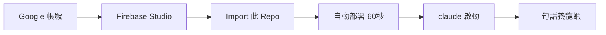

# 🦐 PAIN-000 原型機 — 零成本 AI 代理工場

> **一台 Google IDX 免費雲端電腦，養活你的 AI 兵團。**
>
> 不用付 API 費、不用綁信用卡、不用開伺服器。只要一個 Google 帳號。

---

## 🎬 90 秒看完

```
① 前往 https://idx.google.com
② 新增 Workspace → Import from GitHub → 貼上此 Repo URL
③ 等 2 分鐘自動部署完成
④ 在終端輸入: claude
⑤ 對 Claude 說一句話 → 你的 AI 代理就上線了
```

**總成本：$0.00**

---

## 🎯 這 Repo 為你而生

| 如果你... | 這就是你要的 |
|-----------|-------------|
| 想玩 AI Agent 但不想花錢 | ✅ 所有模型走免費層 |
| 聽過 OpenClaw / Hermes Agent 想試試 | ✅ Claude Code 一句話部署 |
| 開發者預算$0 | ✅ Firebase Studio 完全免費 |
| 想要自己的 AI API 代理 | ✅ 內建 9router 路由 |
| 只想看看能搞什麼 | ✅ 零成本零風險，玩壞了重建一臺 |

---

## 🚀 一鍵啟動

### 你需要什麼

- 一個 Google 帳號（Gmail 即可）
- 瀏覽器

### 步驟



**① 前往 Firebase Studio**

打開 [idx.google.com](https://idx.google.com)，用你的 Google 帳號登入。

**② 匯入此專案**

點擊 **New Workspace** → **Import from GitHub** → 貼上此 Repo 的 URL。

**③ 等 2 分鐘**

所有東西自動安裝好——Docker、9router AI 路由、Claude Code 設定。你只需要看著日誌。

**④ 啟動 Claude Code**

在終端輸入：

```bash
claude
```

這是跟你本機完全一樣的 Claude Code CLI，但**所有 API 請求都走免費路由**。

**⑤ 一句話，你的 AI 代理上線**

對 Claude 說：

> **「我要養龍蝦」** 🦐

Claude 會自動 clone OpenClaw Agent 並完成部署。或者：

> **「幫我裝 Hermes Agent」** 

一樣一句話搞定。

---

## 🔧 部署後有什麼

| 資源 | 說明 |
|------|------|
| **2 vCPU + 4GB RAM** | Google IDX 免費額度，24/7 運行 |
| **Docker 24.0.9** | Rootless 模式，安全隔離 |
| **9router AI 閘道** | Port 20128，彙整免費模型 |
| **Claude Code** | 設定好指向本地 9router |
| **OpenCode Free** | 零成本 DeepSeek V4、Mimo 2.5 |
| **SSH 後門** | Port 2222，可從外部連入 |

---

## 📋 管理與監控

```bash
# 容器狀態
export DOCKER_HOST="unix:///tmp/run-1000/docker.sock"
docker ps

# 9router 儀表板
open http://localhost:20128

# 觀看路由日誌
docker logs -f 9router

# 查看憑證
cat ~/.9router/credentials.txt
```

---

## 💡 你可以做的事

- **免費 Claude Code** — 用免費模型寫 code、除錯、重構
- **養 OpenClaw Agent** — 一句話部署分散式 AI 代理
- **跑 Hermes Agent** — 測試自主 AI 框架
- **自建 API Proxy** — 路由到多個免費/低價 LLM
- **學習 Kubernetes** — IDX 2vCPU 夠跑 minikube
- **跑自動化腳本** — cron + Docker 24/7 批次任務

---

## 🛡️ 安全

- 每臺 Workspace 彼此隔離（Google Cloud 沙箱）
- 9router 啟用 API Key 驗證
- 所有憑證首次啟動自動隨機生成
- 不留機敏資料在 Git 中

---

## ❓ 常見問題

**真的是免費嗎？**
> 是的。Firebase Studio (IDX) 目前提供免費 Workspace，沒有任何付費計畫。Google 可能未來調整政策，但只要 IDX 免費，此方案就免費。

**我的資料安全嗎？**
> 每臺 Workspace 是獨立的 Cloud Workstation，其他人無法存取。關閉 Workspace 後 `/home/user` 以外的資料會遺失，建議定期備份。

**Workspace 會休眠嗎？**
> IDX 在閒置一段時間後會暫停。重開時 `.idx/dev.nix` 會重新執行，所有服務自動恢復。

**可以用自己的模型嗎？**
> 可以。9router 支援自訂路由，可以接入 OpenAI、Anthropic 或任何 OpenAI 相容 API。

---

## 🗺️ 下一步

完整技術細節請看 **[PAIN-000 原型機圖紙](PAIN-000_原型機圖紙.md)**。

---

## 📜 License

MIT — 自由使用、修改、分享。

---

**Status:** ✅ Free Lead Magnet  
**Version:** PAIN-000  
**Last Updated:** 2026-06-14  

*「零成本不是夢想，是你的第二臺雲端電腦。」*
